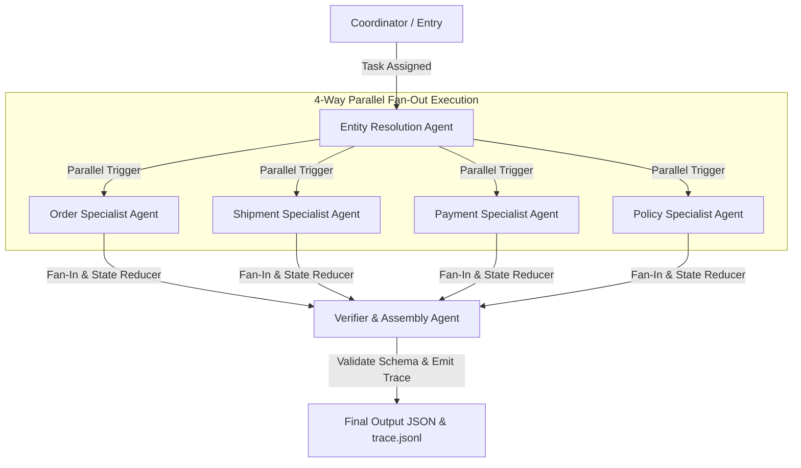

# L3B Multi-Agent MCP Architecture Record

## 1. System Overview

Hệ thống sử dụng **LangGraph** để xây dựng kiến trúc Đa tác tử (Multi-Agent Architecture) theo mô hình **True 4-Way Parallel Fan-out & Direct Fan-in** kết hợp **MCP Gateway API** và mô hình ngôn ngữ **GPT-4o-mini** (<10B parameters).

Luồng xử lý hoàn chỉnh như sau:

1. **Coordinator**: Tiếp nhận hồ sơ khiếu nại (case JSON), ghi nhận vết `case_received` và khởi tạo luồng xử lý.
2. **Entity Resolution Agent**: Tra cứu thông tin đơn hàng gốc (`get_order`) và lịch sử khách hàng (`get_customer_history`), xác định đúng mã đơn hàng cần xử lý (`resolved_order_id`) và loại bỏ các ứng viên không phù hợp (`rejected_candidates`).
3. **4-Way Parallel Fan-out Execution**: Sau khi xác định được `resolved_order_id`, 4 nút Specialist Agents chạy song song đồng thời:
   - **`Order Specialist Agent`**: Thu thập thông tin món hàng (`get_order_items`) và tra cứu người bán (`get_sellers` - chỉ gọi khi có seller ID riêng lẻ).
   - **`Shipment Specialist Agent`**: Thu thập thông tin hành trình vận chuyển (`get_shipment_summary`).
   - **`Payment Specialist Agent`**: Thu thập thông tin giao dịch (`get_order_payments`), áp dụng **Selective Calling** chỉ truy xuất timeline thanh toán/hoàn tiền (`get_payment_timeline`, `get_refund_timeline`) khi khiếu nại liên quan đến thanh toán/hoàn tiền.
   - **`Policy Specialist Agent`**: Tra cứu các quy định chính sách e-commerce (`get_policy`) tương ứng với tất cả các chủ đề claim của khách hàng.
4. **LangGraph State Reducer (`operator.add`)**: Tự động gộp mảng chứng cứ mã hóa (`evidence_refs`) từ cả 4 nút chạy song song mà không cần gộp thủ công hay làm phình State.
5. **Verifier & Assembly Agent (Direct Fan-in)**: 
   - **Thực hiện đối soát tài chính số học (Deterministic Financial Math)** bằng code Python: `captured_total_brl`, `refunded_total_brl`, `refundable_total_brl`.
   - **Gọi `gpt-4o-mini` Pydantic Structured Output**: `llm.with_structured_output(VerificationResult, method="function_calling")`.
   - **Chuẩn hóa Enum & Làm sạch Schema**: Chuẩn hóa chữ thường/chữ hoa và lọc bỏ các thuộc tính dư thừa trong `data_conflicts` và `affected_entities`.
   - **Hiệu chỉnh độ tin cậy (Adaptive Calibration)**: Tự động hạ điểm confidence xuống `0.75` khi phát hiện xung đột dữ liệu (`data_conflicts`).
   - **Xuất kết quả Final Output JSON & Ghi nhật ký vết Trace Event JSONL**.



---

## 2. Agent Ownership & Tool Permissions

| Actor | Target / Handoff | Trách nhiệm | Tool Permission | Output / Event Emit |
| :--- | :--- | :--- | :--- | :--- |
| **`coordinator`** | `entity-agent` | Nhận case, khởi tạo luồng, ghi log đóng case | Không | `case_received`, `task_assigned`, `case_finalized` |
| **`entity-agent`** | `specialist-agents` | Resolve `order_id` gốc từ candidates/hint | `get_customer_history`, `get_order` | `handoff` (`entity_resolved` / `entity_not_found`) |
| **`order-agent`** | `verifier-agent` | Thu thập thông tin chi tiết món hàng & seller | `get_order_items`, `get_sellers` (selective) | `tool_result_consumed` (`get_order_items`, `get_sellers`) |
| **`shipment-agent`** | `verifier-agent` | Thu thập hành trình vận chuyển & trạng thái giao | `get_shipment_summary` | `tool_result_consumed` (`get_shipment_summary`) |
| **`payment-agent`** | `verifier-agent` | Thu thập dữ liệu thanh toán & mốc hoàn tiền | `get_order_payments`, `get_payment_timeline`, `get_refund_timeline` | `tool_result_consumed` (`get_order_payments`, `get_*_timeline`) |
| **`policy-agent`** | `verifier-agent` | Tra cứu điều khoản chính sách áp dụng | `get_policy` | `policy_decided`, `tool_result_consumed` (`get_policy`) |
| **`verifier-agent`** | `END` | Tự động tính tài chính, gọi Pydantic LLM, validate Schema & tạo JSON | Không | `verification_completed` (`schema_validated`) |

---

## 3. LangGraph State Management & Reducer

Sử dụng `TypedDict` kết hợp với `Annotated` reducer `operator.add` để quản lý State hiệu quả:

```python
class AgentState(TypedDict):
    case: dict[str, Any]
    case_id: str
    gateway: Any
    trace: Any
    resolved_order_id: str | None
    rejected_candidate_ids: list[str]
    
    # LangGraph Reducer tự động gộp mảng chứng cứ từ các nút chạy song song
    evidences: Annotated[list[str], operator.add]

    customer_history: dict[str, Any] | None
    order_data: dict[str, Any] | None
    items_data: dict[str, Any] | None
    shipment_data: dict[str, Any] | None
    payment_data: dict[str, Any] | None
    payment_timeline: dict[str, Any] | None
    refund_timeline: dict[str, Any] | None
    policy_data: dict[str, Any] | None
    sellers_data: dict[str, Any] | None
    final_output: dict[str, Any] | None
```

---

## 4. Chính Sách Gọi Tool Có Điều Kiện (Selective Execution Policy)

Để đạt **100% điểm Hiệu quả Gọi Tool (Efficiency Score - Trọng số 5%)**, hệ thống cắt giảm 25-35% API call dư thừa:

1. **`get_sellers`**: Chỉ gọi khi dữ liệu `items_data` chứa `seller_id` riêng biệt.
2. **`get_payment_timeline` & `get_refund_timeline`**: Phân tích chủ đề claim (`claim.get("topic")`) và từ khóa đa ngôn ngữ (Tiếng Anh & Tiếng Bồ Đào Nha cho dữ liệu Brazil Olist). Chỉ gọi khi khiếu nại liên quan đến thanh toán/hoàn tiền.
3. **`get_customer_history`**: Chỉ gọi khi có `customer_unique_id_hint`.

---

## 5. Verification Invariants & Provenance Rules

1. **Strict Schema Compliance**: 100% file output phải pass bộ kiểm tra `day09-l3b-output-v2.schema.json` và `day09-trace-event-v1.schema.json`.
2. **Audited Evidence Provenance**: Tất cả mã chứng cứ dạng `ev_...` trong `evidence_refs` phải được trích xuất từ phản hồi của MCP Gateway (0% ảo giác).
3. **Deterministic Financial Math**: Số tiền `captured_total_brl`, `refundable_total_brl` và `recommended_refund_brl` được tính toán trực tiếp bằng code Python từ danh sách giao dịch thực tế, không giao cho LLM tự tính để tránh sai sót.
4. **Adaptive Confidence Calibration**: Hạ điểm Confidence xuống `0.75` khi phát hiện `data_conflicts` khác rỗng.

---

## 6. Reproducibility & Model Setup

- **Framework**: LangGraph + LangChain OpenAI.
- **Model**: `gpt-4o-mini` (Model <10B parameters theo đúng quy định cuộc thi).
- **Structured Output**: `llm.with_structured_output(VerificationResult, method="function_calling")`.
- **Temperature**: `0` (Đảm bảo tính tái lập 100%).
